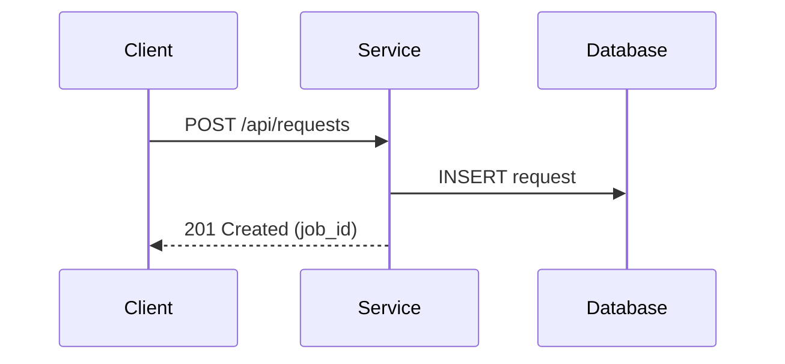

# Structured Documentation Standard

This standard defines how to structure, write, and present documentation for software projects. It covers the organization, the explanation style, and the information elements used to convey meaning. It does not prescribe a specific documentation framework, markup syntax, or static site generator. Implement the elements described here in whatever framework you use.

## 1. Scope

### 1.1. Two Tracks

A documentation set built to this standard has two tracks:

- **User Guide** — for end users and operators who interact with the system but do not read code. Focuses on how-to guides, workflows, and visual instructions.
- **Tech Guide** — for developers and integrators who need to understand internals, APIs, data models, and configuration.

If a project serves only technical people, omit the User Guide. The Tech Guide is always present.

### 1.2. Track Relationship

The two tracks are separate documentation sets. They live in separate directory trees, have separate navigation, and do not share pages. They cross-reference each other with links when a topic spans both audiences.

```
docs/
  user-guide/
    content/
  tech-guide/
    content/
```

A user guide page that needs technical depth links to the relevant tech guide page with a note: "For technical details, see the [Tech Guide](/tech-guide/...)". A tech guide page that has user-facing instructions links to the user guide equivalent.

Do not duplicate content across tracks. If the same information belongs in both, write it once in the tech guide and link to it from the user guide, or vice versa — whichever audience it primarily serves.

### 1.3. Shared Rules

Both tracks follow the same structural rules, writing style, and information elements defined below. They differ in audience and content depth, not in format.

## 2. Directory Structure

### 2.1. Numbered Sections

Organize documentation into numbered top-level sections. The number controls display order.

```
content/
  0.index.md              # landing page
  1.getting-started/      # orientation
  2.understanding/        # conceptual deep-dive
  3.api-reference/        # contract reference
  4.integrations/         # per-system integration pages
  5.development/          # config, testing, deployment
  8.release-notes.md      # changelog (high number = end of file ordering)
```

Leave a numbering gap between the last regular section and release notes (e.g. 5 then 8). This lets you insert new sections without renumbering existing ones.

### 2.2. Numbered Files

Number files inside a section the same way. The number controls order within the section.

```
1.getting-started/
  1.overview.md
  2.architecture.md
  3.glossary.md
```

Use the `N.title.md` format (dot separator), not `N-title.md` (hyphen). The dot format is compatible with more documentation frameworks and sorts correctly in file explorers.

### 2.3. Version-Like Filenames

If a file represents a versioned artifact (e.g. an API version, a schema version), use the version number directly as the filename: `2.1.2.md`. The ordering prefix rule does not apply to these files — the version number is the name.

Distinguish ordering prefixes from version numbers by the pattern:

- An ordering prefix is `N.` followed by a word (`2.overview.md`).
- A version is two or more numeric segments separated by dots, followed by `.md` and nothing else (`2.1.2.md`, `2.1.md`).

A filename with a single numeric segment followed by `.md` (e.g. `2.md`) is ambiguous. Do not use it. Either add an ordering prefix with a word (`2.summary.md`) or use a multi-segment version (`2.0.md`).

### 2.4. Index and Overview Files

- A section's landing page is `0.index.md` or `0.overview.md`. The `0.` prefix places it first.
- If a section has a conceptual introduction that is not just a navigation landing, name it `0.overview.md` or `0.introduction.md`.
- The root `0.index.md` is the documentation home page.

### 2.5. Subdirectories

When a section has enough content to split into sub-groups, use numbered subdirectories:

```
2.understanding/
  0.overview.md
  1.building-blocks/
    1.first-component.md
    2.second-component.md
  2.subsystem-deep-dive/
    0.overview.md
    1.first-aspect.md
```

Subdirectories follow the same numbering rules as top-level sections.

### 2.6. Section Metadata

Each directory has a metadata file that defines how the section appears in navigation. The metadata file is named according to your framework's convention (e.g. `_dir.yml`, `_index.md`, `index.json`). It contains:

| Field         | Required | Scope                   | Purpose                                                       |
| ------------- | -------- | ----------------------- | ------------------------------------------------------------- |
| `title`       | yes      | all directories         | Section name shown in navigation                              |
| `description` | yes      | all directories         | One-line summary of what the section covers                   |
| `icon`        | no       | top-level sections only | Visual identifier for the section in navigation               |
| `redirect`    | no       | all directories         | The page the user lands on when they click the section in nav |

Rules:
- Include `icon` only for top-level sections. Never for subdirectories or individual pages.
- Set `redirect` to the first or overview page in the section, so clicking the section name in navigation takes the reader to content, not to an empty landing.
- The `description` in the metadata file is the single source of truth for the section description. Reuse it in landing page cards and cross-references.

### 2.7. Standard Section Set — Tech Guide

A complete Tech Guide has these sections, in this order:

| Number | Section         | Purpose                                                                   |
| ------ | --------------- | ------------------------------------------------------------------------- |
| 1      | Getting Started | Overview, architecture, glossary                                          |
| 2      | Understanding   | Core concepts, building blocks, subsystem deep-dives                      |
| 3      | API Reference   | Endpoint tables, request/response schemas, data models, message contracts |
| 4      | Integrations    | One page per external system that connects to this system                 |
| 5      | Development     | Configuration, environment setup, testing, deployment, tooling            |
| 8      | Release Notes   | Versioned changelog                                                       |

Release Notes is a single file (`8.release-notes.md`), not a directory. It has no sub-pages. The high numbering gap (5 then 8) leaves room to insert new sections above it without renumbering.

Projects may add or remove sections. The numbering and ordering principles stay the same.

### 2.8. Standard Section Set — User Guide

A User Guide has these sections, in this order:

| Number | Section         | Purpose                                     |
| ------ | --------------- | ------------------------------------------- |
| 1      | Getting Started | Overview, first steps, glossary             |
| 2      | How-To Guides   | Task-oriented walkthroughs with screenshots |
| 3      | Integrations    | Per-system usage from the user perspective  |

Projects may add or remove sections. The numbering and ordering principles stay the same.

The User Guide has no Release Notes section. Release notes are a developer concern — they describe internal changes, fixes, and infrastructure work that end users do not act on. If a change affects user-facing behavior, document it in the relevant How-To Guide page and link to the Tech Guide release notes for the technical detail.

## 3. Page Anatomy

Every documentation page follows this structure, top to bottom. Not every page has every part, but the order is fixed.

### 3.1. Frontmatter

Every page starts with YAML frontmatter:

```yaml
---
title: Page Title
description: One-line description of what this page covers
---
```

| Field         | Required | Purpose                                                                                                              |
| ------------- | -------- | -------------------------------------------------------------------------------------------------------------------- |
| `title`       | yes      | Page heading and navigation label. Title Case.                                                                       |
| `description` | yes      | One sentence. Used for SEO, nav tooltips, and landing page cards.                                                    |
| `navigation`  | no       | Set to `false` to hide the page from the navigation sidebar.                                                         |
| `noindex`     | no       | Set to `true` to exclude the page from the sitemap and add a `<meta name="robots" content="noindex">` tag. See 10.3. |
| `layout`      | no       | Override the default page layout.                                                                                    |

The exact field names depend on your framework. The concepts are: a title, a description, a way to hide from navigation, and a way to override layout.

Rules:
- The `title` in frontmatter and the `# H1` heading in the body must match exactly.
- The `description` is one sentence. If you cannot describe the page in one sentence, the page covers too much — split it.

### 3.2. H1 Heading

The first line after frontmatter is a single `#` heading that matches the frontmatter `title`:

```markdown
# Export Service
```

One H1 per page. No exceptions.

### 3.3. Opening Paragraph

Immediately after the H1, write 1-3 paragraphs that answer:

1. What is this?
2. Why does it exist?
3. What is the reader looking at?

Start with the subject directly. The opening paragraph is the reader's orientation — it tells them whether they are on the right page.

Example:

> The export service is a background job that converts records to CSV files. The client sends an export request with filter criteria, the service queries the database, generates the file, and stores it in object storage. The client receives a download URL.
>
> This is the flow used for bulk data extraction. Clients submit export requests through the API, which creates a job record and returns a job ID. The client polls the job status endpoint until the file is ready, then downloads it.

### 3.4. Numbered Sections (H2)

Divide the page into numbered `##` sections. Numbering helps the reader reference specific parts and gives the page a natural reading order.

```markdown
## 1. How the System Creates Jobs
## 2. Request and Response Flow
## 3. How Webhooks Work
## 4. API Endpoints
```

Rules:
- Start at 1. Number every H2 on the page.
- The section title describes the content. Use "How [subject] [verb]" for explanatory sections. Use a noun phrase for reference sections ("API Endpoints", "Configuration Variables").
- Number the closing sections (Next Steps, References) like any other section.
- Exception: Release Notes pages use version numbers as H2 headings (`## X.Y.Z`), not sequential numbers. See 4.8.

### 3.5. Sub-Numbered Sections (H3)

Within a numbered section, use sub-numbered `###` headings:

```markdown
## 3. How Webhooks Work

### 3.1. Webhook Processing
### 3.2. Status Mapping
```

Rules:
- The sub-number includes the parent section number (3.1, not 1).
- Do not go deeper than H4 (`#### 3.1.1`). If you need H5, the page is too long — split it into two pages.
- Exception: Release Notes pages use category labels as H3 headings (`### Features`, `### Fixes`), not sub-numbers. See 4.8.

### 3.6. Closing Sections

Conceptual pages end with two standard sections:

**Next Steps** — links to related pages the reader should visit next:

```markdown
## 6. Next Steps

- [Export Service](/understanding/building-blocks/export-service) — Background job for bulk data extraction
- [Import Service](/understanding/building-blocks/import-service) — Streaming ingestion from external sources
```

**References** — footnote definitions for all source references used in the page body:

```markdown
## 7. References

[^1]: [Export Gateway](https://repo/path/to/gateway.py) — Creates and inspects export jobs.
[^2]: [Client System](https://repo/client-system) — External system that connects to this service.
```

Rules:
- Conceptual pages (overview, building block, integration) have both Next Steps and References.
- Reference pages (API endpoints, data models, configuration) have References only. They do not need Next Steps because the reader navigates them by lookup, not by reading sequentially.
- The landing page (`0.index.md`) has neither Next Steps nor a numbered References section. It uses cards instead (see 5.8). If a card description uses a footnote, define it in an unnumbered References section at the bottom of the page (see 4.1).
- Release notes pages have neither Next Steps nor References. They are a flat list of version entries (see 4.8).
- The References section is numbered like any other section. It is the last numbered section on the page. The landing page is the single exception: its References section is unnumbered.

## 4. Page Types

Different page types have different required sections. Use the right template for the right content. Each template below shows the required structure. Add sections as needed, but keep the order.

### 4.1. Landing Page

The home page of the documentation. Uses cards, not prose.

```
frontmatter (title, description, hidden from navigation)
# Title
[card grid: one card per top-level section]
[unnumbered References section if footnotes are used in card descriptions]
```

### 4.2. Overview Page

Orientation for a section or topic.

```
frontmatter (title, description)
# Title
[opening paragraph: what is this, why does it exist]
## 1. [first aspect]
## 2. [second aspect]
...
## N. Next Steps
## N+1. References
```

### 4.3. Building Block Page (Conceptual Deep-Dive)

Explains how a component works and why it exists.

```
frontmatter (title, description)
# Title
[opening paragraph: what is this component, what role does it play]
## 1. How the System [does X]
### 1.1. The Request DTO
[field definition table]
### 1.2. The Response DTO
[field definition table]
## 2. Request and Response Flow
[side-note: Process Flow]
[numbered list of steps]
## 3. [edge cases or sub-behaviors]
## N. Next Steps
## N+1. References
```

### 4.4. API Endpoint Page

Reference for HTTP endpoints.

```
frontmatter (title, description)
# Title
[opening paragraph: what endpoints are on this page, when are they available]
## 1. [Resource Group Name]
[paragraph: what this resource group does]
Base path: /path
[endpoint table]
### 1.1. Query Parameters
[parameter table]
### 1.2. Create Request Schema (SchemaName)
[field definition table]
### 1.3. Response Schema (SchemaName)
[field definition table]
[note: any validation rules or constraints]
## 2. References
```

### 4.5. Data Model Page

Reference for database tables and models.

```
frontmatter (title, description)
# Title
[opening paragraph: what database, what it stores]
## 1. Base Model
[paragraph + field definition table of shared columns]
## 2. `table_name`
[paragraph: what this table tracks]
[field definition table with constraints column]
### 2.1. Unique Constraint
[paragraph]
### 2.2. `EnumName` Enum
[enum value table]
### 2.3. `property_name` Property
[paragraph: what it returns and when]
[note: any gotchas about the property]
## 3. References
```

### 4.6. Integration Page (Per External System)

Explains how one external system connects to this system.

```
frontmatter (title, description)
# Title
[opening paragraph: what system, what language/platform, how it connects]
[note: source availability note if the system's code is not in the local workspace]
## 1. Connection Methods
[connection method table]
## 2. [System-Specific Identifiers]
[identifier table: IDs, mappings, etc.]
## 3. Operations
### 3.1. [Protocol A] — [Purpose]
[paragraph + table or list]
[side-note: Process Flow]
[numbered list of steps]
### 3.2. [Protocol B] — [Purpose]
[paragraph + table]
## 4. Post-Processing
[paragraph: what happens after the main operation]
[note: any known bugs or quirks]
## 5. Next Steps
- [related integration](/integrations/...) — One-line description
- [related building block](/understanding/...) — One-line description
## 6. References
```

### 4.7. Configuration Page

Reference for configuration variables.

```
frontmatter (title, description)
# Title
[opening paragraph: how config is loaded, where it lives]
## 1. Section Name (`PREFIX_`)
[paragraph: what this section controls]
[configuration variable table]
### 1.1. Sub-section
[paragraph + table]
## 2. References
```

### 4.8. Release Notes Page

Versioned changelog.

```
frontmatter (title, description, hidden from navigation)
# Release Notes
## X.Y.Z
[one-line summary]
### Features
- [feature bullet]
### Fixes
- [fix bullet]
### Integrations
- [integration bullet]
### Infrastructure
- [infrastructure bullet]
```

Rules:
- Hide release notes from the navigation sidebar. Link to them from other pages; readers do not browse them.
- Newest version at the top.
- Group entries under `### Features`, `### Fixes`, `### Integrations`, `### Infrastructure`. Omit empty groups.
- Each entry is one bullet, one line.
- Release notes are cumulative within a version line. A version's release notes page shows every release in that line up to and including that version. See 11.3 for how this interacts with documentation versioning.

## 5. Information Elements

Use these elements to convey information. Each has a specific purpose. Use the right element for the right content.

### 5.1. Tables

Tables are the primary structure for reference data: field definitions, endpoint lists, status codes, configuration variables, enum values.

**Field definition table** — used for DTOs, schemas, database columns:

| Field        | Type   | Required | Default | Description                       |
| ------------ | ------ | -------- | ------- | --------------------------------- |
| `amount`     | int    | yes      | —       | Amount in cents                   |
| `currency`   | string | yes      | —       | ISO 4217 currency code            |
| `return_url` | string | no       | null    | Where the browser redirects after |

Rules:
- Align columns with the header separator. Keep visual alignment across all rows.
- Use `—` (em-dash) for "no default" or "not applicable". Use `null` when null is the actual default value.
- Use backticks for identifiers, field names, and code values.
- Use `string | null` notation for nullable types, not `Optional[string]` or `string?`.
- If cell content is too wide for one line, break it across lines but keep the table visually aligned.

**Endpoint table** — used for API routes:

| Endpoint             | Method | Description          |
| -------------------- | ------ | -------------------- |
| `/api/requests`      | POST   | Create a request     |
| `/api/requests`      | GET    | List all requests    |
| `/api/requests/{id}` | GET    | Get a single request |

**Comparison table** — used for environment differences, before/after, feature matrices:

| Setting      | Development | Production |
| ------------ | ----------- | ---------- |
| Swagger docs | Available   | Disabled   |
| CRUD routes  | Available   | Disabled   |

**Systems table** — used to list external systems and their roles:

| System | Role          | Connection Method |
| ------ | ------------- | ----------------- |
| Alpha  | Client system | TCP, Kafka        |
| Beta   | Admin portal  | HTTP, JSON-RPC    |

### 5.2. Diagrams

Use diagrams for:

- **Architecture overviews** — components and their relationships
- **Sequence diagrams** — request/response flows between systems
- **Dependency graphs** — service startup or data flow dependencies

Rules:
- Place the diagram after a paragraph that introduces what it shows. A diagram without context forces the reader to interpret it blind.
- After the diagram, write a paragraph that explains the key takeaways. Do not repeat what the diagram shows — explain what matters and why.
- Label every node with a short, descriptive name.
- Group related components using subgraphs or clusters.
- Use multi-line labels for complex node names.
- Use a text-based diagram format that renders in the documentation framework and is diff-friendly in source control. Mermaid is the default choice — it renders in most frameworks and lives in the markdown file as a fenced code block. If the framework does not support Mermaid, use PlantUML or another text-based format. Avoid binary diagram files (PNG, SVG exports) unless the diagram cannot be expressed in a text format; in that case, treat it as a Figure (see 5.6).

Pattern:

```
[paragraph: introduces what the diagram shows]

[diagram]

[paragraph: explains the key takeaways]
```

Example (Mermaid sequence diagram):

````

````

### 5.3. Code Blocks

Use fenced code blocks for:

- **Commands** — shell commands the reader should run
- **Configuration** — YAML, TOML, JSON examples
- **Code structure** — directory trees, file content excerpts
- **Message payloads** — JSON/XML request and response examples

Rules:
- Specify the language after the opening fence: `bash`, `yaml`, `json`, `python`, `toml`.
- For directory trees, use a plain code block (no language tag) with ASCII art.
- Keep code blocks short. If a code excerpt is long, show only the relevant part and use a comment or `...` to indicate truncation.
- Show real values, not placeholders, whenever possible. If you must use a placeholder, make it obvious (`<your-api-key>`, not `abc123`).

### 5.4. Notes

Notes highlight important information that the reader would regret missing: gotchas, constraints, clarifications, tips.

Render a note as a blockquote prefixed with **Note:** in bold. This keeps notes framework-agnostic and visually distinct from body text.

```markdown
> **Note:** The `idempotency_key` must be unique per request. Reusing it returns the original response instead of creating a new record.
```

If the framework supports admonition directives (e.g. `:::note` in Docusaurus, `!!! note` in MkDocs Material), use the native directive instead of the blockquote format. The blockquote format is the portable fallback.

Rules:
- One idea per note. If you have two things to say, use two notes.
- Notes are for things the reader would miss if they skimmed. They are not for general information.
- If every paragraph has a note, the notes stop working. Use them sparingly.

### 5.5. Side Notes

Side notes label a block of content that follows them. They act as a category tag for what comes next — typically a process flow, step-by-step list, or reference block.

Standard side-note labels:

| Label              | Use when                                                    |
| ------------------ | ----------------------------------------------------------- |
| Process Flow       | A sequence of steps that happen in order (descriptive)      |
| Step-by-Step       | Instructions the reader should follow in order (imperative) |
| Reference          | A block of reference data (list, table) that follows        |
| Alternative Method | A different way to achieve the same result                  |

Rules:
- Place the side note immediately before the content it labels.
- The side note and its labeled content must be adjacent.
- Use "Process Flow" when describing what the system does. Use "Step-by-Step" when telling the reader what to do.

Render a side note as a bold label on its own line, followed by a blank line, then the labeled content:

```markdown
**Process Flow**

1. The client sends a POST request with the export criteria.
2. The service creates a job record and enqueues it.
3. The worker picks up the job, queries the database, and writes the file to storage.
```

If the framework supports admonition directives with custom titles, use the native directive with the label as the title. The bold-label format is the portable fallback.

### 5.6. Figures

Figures are screenshots, diagrams rendered as images, or any visual that needs a caption. Every figure has:

- A source image (required)
- A dark-mode variant (optional — if absent, the light image is used for both)
- A caption prefixed with "Figure N: " (required)

Rules:
- Number figures sequentially within a page, starting at 1.
- Store images in a static assets directory. Keep a parallel structure to the content tree so an image used by one page lives near that page, not in a shared dump.
- Name the light and dark variants with a `-light` and `-dark` suffix: `export-flow-light.png`, `export-flow-dark.png`. The base name (without the suffix) is the figure identifier used in captions and cross-references.
- Reference both variants in markup so the framework can switch on the reader's theme. Use the framework's native mechanism if it has one (e.g. a `<picture>` element with `prefers-color-scheme`, or a theme-aware image component). If the framework has no native mechanism, embed both and let CSS show the one matching the active theme.
- Provide alt text for every figure. Alt text describes what the figure shows, for readers using screen readers and for cases where the image fails to load. Use the framework's native alt text mechanism (e.g. the `alt` attribute on ``, or the alt prop on an image component). Do not duplicate the caption verbatim — alt text and caption have different jobs.
- The caption explains why the figure matters. It is prefixed with "Figure N: " (see above) and gives the reader the reason to look at the figure.
- If a figure is a screenshot of a UI, capture both light and dark mode.
- Stale screenshots mislead the reader. Verify screenshots are current before publishing.

Image format and quality:
- Prefer vector formats (SVG) for diagrams, icons, and any graphic that scales. SVG stays sharp at every resolution and is the smallest source for line art.
- Use raster formats (PNG, WebP) for screenshots and photographs. Prefer WebP for smaller file size when the framework supports it; fall back to PNG when it does not.
- Do not use JPEG for screenshots or diagrams. JPEG compression introduces artifacts around text and sharp edges.
- Capture screenshots at 2x pixel density (retina) so they stay sharp on high-resolution displays. Downscale the 2x source to 1x for the displayed size if the framework does not handle resolution switching.
- Keep the displayed width of a screenshot at or below the content column width. Do not rely on the browser to shrink an oversized image — export at the target size.
- Keep individual image file size under 500 KB. Optimize with a lossless compressor (e.g. `oxipng`, `svgo`) before committing. Large images slow the page and bloat the repository.

### 5.7. Source References (Footnotes)

Footnotes link to source code, external documentation, or related resources. They are the standard way to reference anything outside the documentation itself.

Usage in body text — append `[^N]` to the term being referenced:

```markdown
The `ExportGateway`[^1] class wraps the SDK client.
```

Definition in the References section at the bottom of the page:

```markdown
## 7. References

[^1]: [Export Gateway](https://repo/path/to/gateway.py) — Creates and inspects export jobs.
```

Rules:
- Number footnotes sequentially within a page, starting at 1.
- Every footnote has a link and a short description after the em-dash.
- Group all footnote definitions under the numbered `## N. References` heading at the bottom of the page.
- Use footnotes for source code files, external system repos, configuration references, and investigation documents.
- Keep external links in footnotes, not in body text. This keeps the body readable and concentrates all external references in one place.

### 5.8. Landing Page Cards

The home page uses a card grid to link to each top-level section. Each card has:

- An icon (top-level sections only)
- A title (linked to the section)
- A one-line description

Rules:
- One card per top-level section.
- The card description matches the section metadata description — single source of truth.
- Order the cards to match the section numbering.

### 5.9. Numbered Lists for Processes

When describing a process or flow, use a numbered list. Each step is one sentence with the actor and the action.

```markdown
1. The system looks up the request by ID. If none exists, it redirects to the error URL.
2. The system calls the gateway to fetch the details. It retries up to 5 times if the status is still in progress.
3. The system checks the response type and either redirects or continues processing.
```

Rules:
- Start each step with the actor (the system, the component, the user).
- One action per step. If a step has two actions, split it into two steps.
- Use sub-lists for conditional branches within a step.

### 5.10. Bullet Lists for Features and Enumerations

Use bullet lists for unordered information: feature lists, key points, available options.

```markdown
- **Export Service**: Converts records to CSV files in the background.
- **Import Service**: Streams data from external sources into the database.
- **Legacy Compatibility**: Accepts connections using the same protocols as the old system.
```

Rules:
- Bold the term being defined, followed by a colon and the description.
- Keep each bullet to one or two lines.
- Do not nest bullets more than two levels deep.

## 6. Writing Style

### 6.1. Voice and Tone

- **Active voice.** Name the actor. "The system creates a record" not "A record is created."
- **Same word for same thing.** If you call it "export job" on page 1, call it "export job" on page 10. Do not vary terms to avoid repetition. Repetition aids clarity.
- **Short noun groups.** Use prepositions to show relationships. "The file from the export job" not "the export-job-derived file artifact."
- **Direct instructions.** For procedures, state the condition, the action, and the expected outcome. "Run `just test` to execute the test suite."
- **No metaphors or figures of speech.** Technical writing is literal.
- **Short words and sentences.** If a short word works, use it. If a sentence can be shorter, make it shorter.
- **Cut unnecessary words.** If removing a word does not change the meaning, remove it.

### 6.2. Positive vs. Negative Instructions

- For procedures and how-to content, use positive instructions. Say what to do, not what not to do. "Use tables for field definitions" is clearer than "Don't use paragraphs for field definitions."
- For standards and rules, prohibitions are acceptable and often clearer. "Do not use emojis" is a rule, not a procedure. This is not a contradiction — the audience reads a rule once and internalizes it, while a procedure is followed step by step where positive guidance reduces errors.

### 6.3. Human Voice

Write as if explaining to a colleague. Avoid AI-sounding language.

| Avoid                            | Do instead                |
| -------------------------------- | ------------------------- |
| "Moving forward, ..."            | Start with the point      |
| "It's important to note that..." | State the thing directly  |
| "In this section, we will..."    | Start with the content    |
| "This page describes..."         | Start with the subject    |
| "As mentioned earlier..."        | Trust the reader's memory |
| "Let's dive into..."             | Start with the content    |
| "It's worth noting that..."      | State the thing directly  |
| "Please note that..."            | State the thing directly  |
| "Leverage" (as a verb)           | Use                       |
| "Utilize"                        | Use                       |
| "In order to"                    | To                        |

### 6.4. No Emojis

Do not use emojis in documentation. Not in headings, not in body text, not in tables, not in notes.

### 6.5. Concrete Before Abstract

Show the concrete thing before the abstract explanation. The reader understands the concrete example, then the explanation makes sense.

Wrong — abstract first:

> Idempotency keys ensure that an operation executes only once, even on retry. The `idempotency_key` field is a UUID4.

Right — concrete first:

> The `idempotency_key` field is a UUID4. Send the same UUID on retries to prevent duplicate operations.

Wrong — theory first:

> The webhook handler translates between the external provider's response format and the internal format that clients expect.

Right — concrete first:

> When the provider sends a webhook to `/webhook`, the handler fetches the resource details, maps them to the internal schema, signs the response, and forwards it to the client's callback URL. This translation exists because the provider's response format differs from the internal format.

### 6.6. Audience Focus

Write for what the reader needs to accomplish, not for what the writer wants to explain.

- An API reference page answers: "What are the endpoints, what do they accept, what do they return?"
- A building block page answers: "How does this component work and why does it exist?"
- A configuration page answers: "What variables do I set and what do they do?"

Do not mix audiences. A user guide page does not explain database internals. A tech guide page does not explain what the product does at a business level. If a topic spans both audiences, write separate pages in each track and cross-reference.

## 7. Accessibility

Documentation is consumed by people with different abilities, devices, and network conditions. Accessibility is a requirement, not an enhancement. Every page must be usable with a keyboard, readable by a screen reader, and legible at high contrast.

### 7.1. Semantic Structure

Use the heading hierarchy the page already defines (see 3.4 and 3.5). Screen readers navigate by heading level. Do not skip levels — do not jump from `##` to `####`. Do not use heading markup for visual styling; use it only for structure.

Rules:
- One H1 per page. The H1 is the page title.
- H2 for top-level sections, H3 for sub-sections, H4 at most one level deeper.
- Do not bold a line to fake a heading. If it is a heading, use heading markup.
- Use HTML sectioning elements (`<section>`, `<nav>`, `<main>`, `<article>`) only when the framework's markdown does not express the structure. Prefer markdown.

### 7.2. Tables

Tables are the primary reference structure (see 5.1). A screen reader reads a table cell by cell. Make the reading order match the visual order.

Rules:
- Every table has a header row. Do not present a table without column headers.
- Use the framework's native table component when it exists. Native components emit the correct `<th scope="...">` markup. Plain markdown tables render as `<th>` without scope, which is acceptable but less precise.
- Do not use a table for layout. If the content is not tabular data, use a list or a definition list.
- Keep tables simple. Avoid merged cells and nested tables. Screen readers handle them poorly.
- If a table is wide, consider splitting it into two narrower tables under separate sub-headings.

### 7.3. Images and Diagrams

Images and diagrams convey information that text alone cannot. They must be perceivable by readers who cannot see them and by readers on small screens.

Rules:
- Every figure has alt text (see 5.6). Decorative images that convey no information use empty alt text (`alt=""`) so the screen reader skips them. Never omit the `alt` attribute.
- Diagrams rendered as images must have alt text that describes the relationships, not the visual layout. "The client sends a request to the service, which queries the database and returns a job ID" — not "a flowchart with three boxes and arrows."
- Do not rely on color alone to convey meaning in diagrams. Add text labels or patterns. Readers with color vision deficiency and readers on monochrome displays cannot distinguish color-coded states.
- Ensure text inside diagrams meets the same contrast ratio as body text (see 7.4). Text that is too small or too low contrast is unreadable when the diagram is scaled down.

### 7.4. Color and Contrast

Color contrast determines whether text is readable. Low contrast is invisible to some readers and a strain for the rest. Both the light and dark theme must pass.

Rules:
- Body text and heading text must meet WCAG 2.1 AA contrast ratios against their background: 4.5:1 for normal text, 3:1 for large text (18pt or 14pt bold).
- Do not convey meaning with color alone. Pair color with a text label, an icon, or a pattern. A status of "error" is shown with the word "Error" and a red badge, not a red badge alone.
- Test both the light and dark theme. A color combination that passes in light mode may fail in dark mode. Verify the dark-mode variant of every figure and every themed UI element.
- Code syntax highlighting must meet the same contrast ratios. Some default highlighting themes fail contrast checks in one mode. Pick a theme that passes in both.

### 7.5. Keyboard Navigation

Not every reader uses a mouse. Some use a keyboard, a screen reader, or a switch device. Every interactive element must be reachable and operable without a pointing device.

Rules:
- Every interactive element is reachable with the Tab key and operable with the keyboard. This includes the search box, navigation sidebar, table-of-contents, and code block copy buttons.
- Interactive elements have a visible focus indicator. Do not remove the default focus outline without providing a replacement.
- The tab order follows the visual reading order: top to bottom, left to right.
- Skip-to-content links are recommended on pages with long navigation. They let keyboard users jump past the sidebar to the main content.

### 7.6. Code Blocks

Code blocks are interactive elements. Readers scroll them, select from them, and copy from them. They must work with the keyboard and with assistive technology.

Rules:
- Code blocks must be focusable so keyboard users can scroll a long block horizontally. Most frameworks handle this with `tabindex="0"` on the `<pre>` element.
- Do not disable text selection in code blocks. Readers copy code.
- If a code block has a copy button, the button must have an accessible label (e.g. `aria-label="Copy code"`), not just an icon.

### 7.7. Automated Verification

Run an accessibility check as part of documentation maintenance. Use a tool that checks the rendered output (e.g. `axe-core`, `pa11y`, `lighthouse`), not just the markdown source. Markdown-level checks catch missing alt text; rendered checks catch contrast, focus, and keyboard issues.

## 8. Internationalization and Localization

If the documentation serves readers in more than one language, structure it for translation from the start. Retrofitting translation onto a single-language documentation set is expensive and error-prone.

### 8.1. Source Language

Pick one source language. All content is written and reviewed in the source language first. Translations are derived from the source. The source language is the source of truth — when a translation conflicts with the source, the source wins.

Rules:
- The source language is declared in the documentation configuration, not inferred from file contents.
- The source language uses the directory structure defined in section 2. Translated copies mirror that structure.
- Do not edit a translation to fix a factual error. Fix the source, then regenerate or update the translation.

### 8.2. Locale Structure

Store each locale in its own directory tree. Do not mix languages in the same tree.

```
docs/
  en/
    user-guide/
    tech-guide/
  pt/
    user-guide/
    tech-guide/
  es/
    user-guide/
    tech-guide/
```

Rules:
- Use BCP 47 language tags for locale directory names: `en`, `en-GB`, `pt`, `pt-BR`, `es`, `es-MX`. Use the shortest tag that distinguishes the variant. Use `pt-BR`, not `pt-BR-x-default`.
- If a project has regional variants of the same language, the base locale (`en`) is the fallback. A request for `en-GB` that has no `en-GB` page falls back to `en`.
- Each locale has its own navigation, search index, and landing page. Do not share navigation across locales.

### 8.3. Translatable Content

Some content translates cleanly; some does not. Structure the source so the translatable parts are separate from the parts that are locale-specific.

Rules:
- Keep translatable text in the markdown body and frontmatter. Do not embed user-facing strings in code, image text, or diagram labels unless you also maintain translated variants of those assets.
- Diagrams with text labels are expensive to translate. Prefer text-based diagram formats (Mermaid, PlantUML) where the labels are text in the source file, not pixels in an image.
- Screenshots with UI text are locale-specific. Capture a separate set per locale. Do not ship an English screenshot in a Portuguese page.
- Dates, times, numbers, and currencies are locale-specific. Use the framework's locale-aware formatting. Do not hardcode a format.
- Avoid idioms, metaphors, and culture-specific references. The writing style already prohibits metaphors (see 6.1). This applies doubly to content that will be translated.

### 8.4. Links and Cross-References

Links in a multi-locale documentation set must keep the reader in their locale. A link that jumps to another language breaks the reading flow.

Rules:
- Internal links stay within the same locale. A link on the `pt` page points to the `pt` version of the target, not the `en` version.
- Cross-track links (see 9.2) stay within the same locale.
- External links do not change across locales, unless the external resource itself has a localized version. Link to the localized version when it exists.
- When a translated page does not exist yet, do not link to the source-language page from within a translated page without a note. A link to a page the reader cannot read erodes trust. Mark the link with the source language: `[Architecture (en)](...)`.

### 8.5. Translation Workflow

Translation is a recurring process, not a one-time task. Track the status of every page so stale translations are visible.

Rules:
- Translate from the source language only. Do not translate from another translation.
- Track translation status per page. A page is either: source-only, in translation, translated, or stale (the source changed after the translation was completed).
- When the source page changes, mark every translation of that page as stale. A stale translation is still published — it is better than no translation — but it is flagged for review.
- Run the same quality checks on translated pages as on source pages: link checking, accessibility, formatting. A translation that breaks a link or a table is not ready to publish.

## 9. Cross-References and Links

### 9.1. Internal Links

Link to other pages within the same documentation track using the page's route path.

Rules:
- Link to the route path, not the file path. The route path strips numeric ordering prefixes (`/getting-started/architecture`, not `/1.getting-started/2.architecture.md`).
- Every conceptual page's Next Steps section links to the pages the reader should visit next.
- Section overview pages link to all sub-pages in the section.
- Use an em-dash after the link to add a short description: `[Architecture](/getting-started/architecture) — How the system is structured`

### 9.2. Cross-Track Links

When a user guide page needs to reference technical depth, link to the tech guide:

```markdown
For technical details, see the [Tech Guide](/tech-guide/api-reference/endpoints).
```

When a tech guide page references user-facing instructions, link to the user guide:

```markdown
For end-user instructions, see the [User Guide](/user-guide/how-to/export-records).
```

### 9.3. External Links

External links to source code, repos, and external documentation go in footnotes (see 5.7). Keep external links out of body text.

### 9.4. Link Verification

All internal and external links must be functional. Run a link checker as part of documentation maintenance. Broken links erode reader trust.

## 10. Search and Discoverability

Readers find pages by search before they find them by navigation. Structure every page so that search — both the documentation site's built-in search and external search engines — can index it correctly.

### 10.1. Page Metadata

The frontmatter fields are the primary input to search. Get them right and the page is discoverable; get them wrong and the page is invisible.

Rules:
- The frontmatter `title` and `description` (see 3.1) are the primary metadata for search. The title is the `<title>` element and the search result headline. The description is the search result snippet.
- The description is one sentence (see 3.1). Search engines truncate snippets around 155 characters. Keep the description under 150 characters.
- The H1 matches the frontmatter title (see 3.2). This is the on-page heading and the search engine's second signal for the page title.
- Do not duplicate the description in the opening paragraph. The description is for search; the opening paragraph is for the reader who already arrived.

### 10.2. URL Structure

The URL is the page's permanent address. Search engines and readers bookmark it. Keep it stable and readable.

Rules:
- The route path is the URL. Use the route path defined in section 2: lowercase, hyphen-separated, no ordering prefixes.
- Keep URLs stable. A URL that changes breaks external links and search rankings. When a page moves, redirect the old URL to the new one.
- Do not use file extensions in URLs (`/getting-started/architecture`, not `/getting-started/architecture.md`).
- Do not use query parameters for page identity. A page's identity is its path.

### 10.3. Sitemap and Indexing

A sitemap tells search engines which pages to crawl. Control it explicitly so the right pages are indexed and the wrong ones are not.

Rules:
- Generate a sitemap.xml that lists every published page. Submit it to search engines.
- Hide non-public pages from indexing. Pages with `noindex: true` (see 3.1) in frontmatter are excluded from the sitemap and carry a `<meta name="robots" content="noindex">` tag.
- Hiding a page from the navigation sidebar (`navigation: false`, see 3.1) does not exclude it from the sitemap or add a noindex tag. A page can be absent from navigation and still indexed by search engines — for example, a standalone landing page linked from external sources.
- The landing page (`0.index.md`) is always indexed. It is the documentation home page.

### 10.4. Built-in Search

The documentation site's built-in search is the reader's primary navigation tool. It must be fast, scoped, and present on every page.

Rules:
- The documentation site has a search box accessible from every page. It is the first interactive element in the header.
- The search index covers page titles, headings, and body text. It does not index code blocks or table cell content unless the search provider supports it.
- Search results show the page title and the description. If the search hit is inside a section, show the section heading as a breadcrumb.
- If the documentation is multi-locale (see 8.2), the search is scoped to the current locale. A reader on the `pt` site searches the `pt` index, not the `en` index.

### 10.5. Headings and Search

Search engines and built-in search use headings to understand page structure. The heading rules in section 3 serve search as well as the reader.

Rules:
- Every H2 and H3 is a potential search result anchor. The heading text is the anchor label.
- Do not use vague headings ("Overview", "Details"). Use descriptive headings ("How the System Creates Jobs") that contain the terms a reader searches for.
- The opening paragraph after the H1 is indexed heavily. Put the most important terms there.

## 11. Documentation Versioning

When the product has multiple supported versions, the documentation must support them too. A reader on product version 2.4 needs the 2.4 documentation, not the latest.

### 11.1. Version the Documentation Set

Version the documentation the same way the product is versioned.

Rules:
- Version the documentation set alongside the product. When the product releases version 2.4, the documentation set has a 2.4 snapshot.
- The latest version lives at the default URL (`/tech-guide/...`). Older versions live under a version prefix (`/2.3/tech-guide/...`).
- The version prefix is the product version, not a documentation version. They are the same.
- Keep one version un-prefixed: the latest. All others are prefixed. This avoids breaking existing links when a new version is released — the old latest moves to its prefixed URL, and the new latest takes the default URL with a redirect from the old content.

### 11.2. Version Selector

The version selector lets a reader switch between documentation versions without leaving the topic. It must be present on every page and must handle missing pages gracefully.

Rules:
- Every page has a version selector. It lets the reader switch between documentation versions while staying on the same logical page.
- If the page does not exist in the selected version, redirect to the closest equivalent. If no equivalent exists, show a page that says the topic was introduced in a later version, with a link to the latest version.
- The version selector lists every supported version, newest first. Mark the latest version explicitly.

### 11.3. What to Version

Version the whole documentation set, not pieces of it. A reader on 2.3 sees a consistent 2.3 experience across every section.

Rules:
- Version the entire documentation set, not individual pages. A reader on 2.3 sees the 2.3 tech guide and the 2.3 user guide.
- Release notes (see 4.8) are cumulative within a version line. The 2.3 release notes page shows every release in the 2.x line up to and including 2.3.
- The glossary (see 12) is versioned. Terms are added and removed across versions. A reader on 2.3 sees the 2.3 glossary.

### 11.4. Backporting Documentation Changes

When a fix applies to a supported older version, backport the documentation alongside the code. A code backport without a documentation backport leaves the older docs wrong.

Rules:
- When a documentation fix applies to a supported older version, backport the change to that version's documentation set.
- A backport is a separate commit against the older version's content tree. Do not assume a change to the latest documentation propagates to older versions.
- Record the backport in the older version's release notes.

### 11.5. End of Life

When a product version reaches end of life, its documentation stays available but is marked as archived. Readers on legacy systems still need it.

Rules:
- When a product version reaches end of life, mark its documentation as archived. The pages stay available but carry a banner: "This version is no longer supported. See the [latest version](/...)."
- Do not delete end-of-life documentation. Readers on legacy systems still need it.
- Remove archived versions from the version selector after a grace period (e.g. one year). Keep the pages accessible by direct URL.

## 12. Glossary

Every documentation set has a glossary page in the Getting Started section. It defines:

- Domain-specific terms (concepts, protocol names, acronyms)
- External system names and what they do
- Project-specific terms

Format each entry as a bullet with the term in bold:

```markdown
- **Export Job**: A background process that converts records to a downloadable file format.
- **Webhook**: An HTTP callback from an external system to this service, notifying it of an event.
```

Rules:
- Group terms by category. Use an H2 heading per category.
- Define the term in one or two sentences. If it takes more, it belongs in a building block page.
- List terms alphabetically within each category.
- Cross-reference the glossary from other pages when introducing a term for the first time. Link the term to the glossary entry.

## 13. Maintenance

Documentation decays. Code changes, pages do not, and the two drift apart. Maintenance is the process of keeping them aligned. It is not a one-time cleanup — it is a recurring practice.

### 13.1. Keep Documentation in Sync

Review documentation after any logic or behavior change. If a field changes, update every table that references it. If a flow changes, update every diagram that shows it. If an endpoint changes, update every page that documents it.

Rules:
- A pull request that changes behavior includes the documentation update in the same pull request. Do not defer documentation to a follow-up.
- If the documentation update is large, open a tracking issue in the same pull request and link to it. Do not leave the documentation untracked.
- When a feature is removed, remove the page that documents it. Do not leave a page describing a feature that no longer exists. Add a redirect from the old URL to the nearest relevant page.

### 13.2. Preserve Existing Content

When updating documentation:

- Preserve original content as much as possible.
- Overwrite previously written content only when it is inaccurate, outdated, or conflicts with a change in the same pull request. When you overwrite, replace the content; do not leave the old version alongside the new.
- Maintain consistency with the rest of the documentation set.

### 13.3. Ownership

Every documentation section has an owner. The owner is the team or individual responsible for keeping the section accurate.

Rules:
- Record ownership in the section metadata file (see 2.6) or in a central ownership file (e.g. `CODEOWNERS`). One or the other, not both.
- The owner reviews documentation changes to their section. The review checks accuracy first, then style.
- When ownership changes, update the ownership record in the same change that transfers responsibility. Do not leave stale ownership.
- A section without an owner is unmaintained. Flag unmaintained sections in the documentation build output so they are visible.

### 13.4. Review Cycles

Documentation drifts from the system over time. Regular reviews catch the drift before the reader does.

Rules:
- Review every page at least once per release cycle. A review is not a rewrite — it is a check that the page still matches the system.
- A review checks: accuracy (does the page match the system), completeness (are new features documented), links (do they still resolve), screenshots (are they current), and formatting (does the page meet the standard).
- Record the last review date in the page frontmatter or in a central review log. A page older than two release cycles without a review is flagged as stale.
- Schedule full documentation reviews after major releases. A major release changes enough that a page-by-page review is the only reliable way to catch every drift.

### 13.5. Stale Content Detection

A page is stale when the code it documents has changed since the page was last reviewed. Detect stale pages automatically so they are reviewed before they mislead.

Rules:
- Flag a page as stale when the source code it references has changed since the page was last reviewed. Use the source references (see 5.7) to map pages to code files, then compare commit dates.
- A stale page is still published. It is flagged for review, not hidden. Hiding it leaves the reader with nothing.
- Display a stale banner on the page: "This page may be out of date. Last reviewed [date]." The banner links to the tracking issue or the owner.
- Remove the stale flag after a review confirms the page is current.

### 13.6. Automated Checks

Run automated checks on every documentation change and on a schedule. Automated checks catch what a reviewer misses.

| Check           | Tool examples                   | What it catches                                      |
| --------------- | ------------------------------- | ---------------------------------------------------- |
| Link checking   | `lychee`, `markdown-link-check` | Broken internal and external links                   |
| Accessibility   | `axe-core`, `pa11y`             | Missing alt text, contrast failures, keyboard issues |
| Markdown lint   | `markdownlint`                  | Heading order, trailing whitespace, list style       |
| Spelling        | `cspell`, `aspell`              | Typos and inconsistent terms                         |
| Prose lint      | `vale`                          | AI-sounding phrases, passive voice, banned words     |
| Screenshot diff | `playwright`, `puppeteer`       | UI changes that make screenshots stale               |

Rules:
- Run the fast checks (link, markdown, spelling, prose) on every pull request. They finish in seconds and catch the most common errors.
- Run the slow checks (accessibility, screenshot diff) on a schedule or before a release. They require a built site and take longer.
- A failing check blocks the merge. Do not merge with known failures and track them as issues.
- Configure the spelling and prose linters with a project dictionary. Add domain terms and product names so they are not flagged.

### 13.7. Quality Criteria

Every page must meet:

- **Accuracy** — every statement matches the current system behavior exactly.
- **Completeness** — document the happy path, edge cases, and error conditions.
- **Formatting** — align tables, tag code blocks with a language, number headings.
- **Links** — all internal and external links are relevant and functional.
- **Accessibility** — the page meets the criteria in section 7.
- **Discoverability** — the page has a title and description that search can index (see 10).

## 14. Quick Reference Checklist

Before publishing a page, verify:

- [ ] Frontmatter has `title` and `description`
- [ ] One H1 heading, matching the frontmatter title
- [ ] Opening paragraph answers what, why, and what the reader is looking at
- [ ] Sections are numbered (`## 1.`, `## 2.`, ...)
- [ ] Sub-sections are sub-numbered (`### 1.1.`, `### 1.2.`, ...)
- [ ] Tables are visually aligned with correct column types
- [ ] Diagrams have an introducing paragraph before and an explanation after
- [ ] Code blocks have language tags
- [ ] Notes are used for gotchas, not for general information
- [ ] Side notes label the content that follows them
- [ ] Figures are numbered with captions and alt text
- [ ] Images use the correct format (SVG for diagrams, PNG/WebP for screenshots) and are under 500 KB
- [ ] Source references use footnotes, defined in the References section
- [ ] Conceptual pages have a Next Steps section
- [ ] Conceptual and reference pages have a References section
- [ ] Cross-track links point to the correct track (User Guide to Tech Guide and vice versa)
- [ ] Glossary terms are cross-referenced when introduced for the first time
- [ ] Page content matches its audience (User Guide vs Tech Guide)
- [ ] No emojis
- [ ] No AI-sounding phrases
- [ ] Active voice throughout
- [ ] Same word for same thing
- [ ] Concrete examples before abstract explanations
- [ ] All links are functional
- [ ] Heading hierarchy has no skipped levels
- [ ] Every table has a header row; no tables used for layout
- [ ] Every image has alt text (empty alt for decorative images)
- [ ] Color is not the sole carrier of meaning in diagrams and UI elements
- [ ] Text meets WCAG 2.1 AA contrast in both light and dark themes
- [ ] All interactive elements are keyboard-reachable with a visible focus indicator
- [ ] Code blocks are focusable and copy buttons have accessible labels
- [ ] Description is under 150 characters for search snippets
- [ ] URL is stable, lowercase, hyphen-separated, no file extension
- [ ] Headings are descriptive (not vague) and contain searchable terms
- [ ] If multi-locale, the page exists in the source language and is tracked for translation
- [ ] If multi-locale, links stay within the same locale
- [ ] If multi-version, the page is in the correct version set and the version selector works
- [ ] Page owner is recorded and the last review date is current
