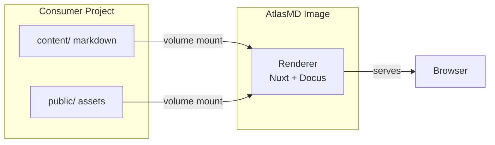

# Overview

AtlasMD is a documentation rendering engine built on [Docus](https://docus.dev) and [Nuxt](https://nuxt.com). It packages the rendering machinery (Nuxt config, Vue components, CSS, plugins) into a Docker image that consumer projects use to serve their own markdown content.

## How It Works

Consumer projects keep only markdown content and static assets. The AtlasMD Docker image provides the rendering engine. At container startup, Nuxt reads the mounted content and serves the documentation site.

## What Consumer Projects Need

| Item                 | Location         | Purpose                                                          |
| -------------------- | ---------------- | ---------------------------------------------------------------- |
| `content/`           | Consumer project | Markdown files and `_dir.yml` navigation configs                 |
| `public/`            | Consumer project | Favicons, logos, static images                                   |
| `docker-compose.yml` | Consumer project | Service definition that mounts content and public into the image |

Consumer projects do not need Node.js, Nuxt, or any JavaScript tooling.

## The Scaffold

The `atlasmd-scaffold/` folder in this repository is a template. Copy it into your project to get started. It contains:

- `content/` — Example documentation structure with this guide
- `public/` — Placeholder for favicons and logos
- `docker-compose.yml` — Ready-to-use compose file

See [Integration Guide](/getting-started/integration) for step-by-step instructions.
