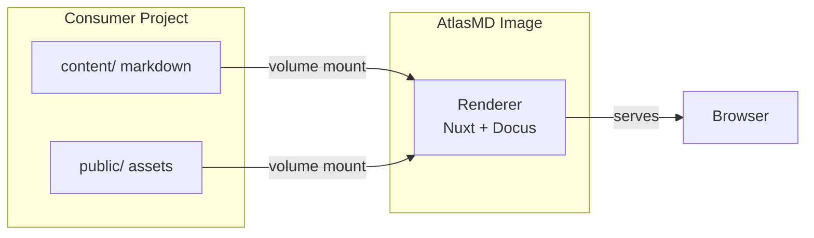

# Overview

AtlasMD is a documentation rendering engine built on [Docus](https://docus.dev) and [Nuxt](https://nuxt.com). It seals the entire rendering machinery — Nuxt config, Vue components, CSS, plugins — into a Docker image. Consumer projects mount their markdown and get a themed, searchable, dark-mode-ready documentation site. No `node_modules`. No build pipeline. No JavaScript knowledge required from the people writing the docs.

## 1. How It Works

Consumer projects keep only markdown content and static assets. The AtlasMD Docker image provides the rendering engine. At container startup, Nuxt reads the mounted content and serves the documentation site. The people writing the docs never touch JavaScript.

## 2. What Consumer Projects Need

| Item          | Location         | Purpose                                                                   |
| ------------- | ---------------- | ------------------------------------------------------------------------- |
| `content/`    | Consumer project | Markdown files and `_dir.yml` navigation configs                          |
| `public/`     | Consumer project | Favicons, logos, static images                                            |
| `config.toml` | Consumer project | Consumer configuration (title, social links, footer)                      |
| `compose.yml` | Consumer project | Service definition that mounts content, public, and config into the image |

Consumer projects do not need Node.js, Nuxt, or any JavaScript tooling.

## 3. The Scaffold

The `atlasmd-scaffold/` folder in this repository is a template. Copy it into your project to get started. It contains:

- **content/** — Example documentation structure with this guide
- **public/** — Placeholder for favicons and logos
- **config.toml** — Consumer configuration (title, social links, footer)
- **compose.yml** — Ready-to-use compose file

See [Integration Guide](/getting-started/integration) for step-by-step instructions.

## 4. Next Steps

- [Integration Guide](/getting-started/integration) — Add AtlasMD to your own project
- [Building Blocks](/building-blocks/note) — Components and rendering elements
- [Configuration](/configuration/overview) — TOML config file, content conventions, customization
