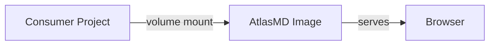
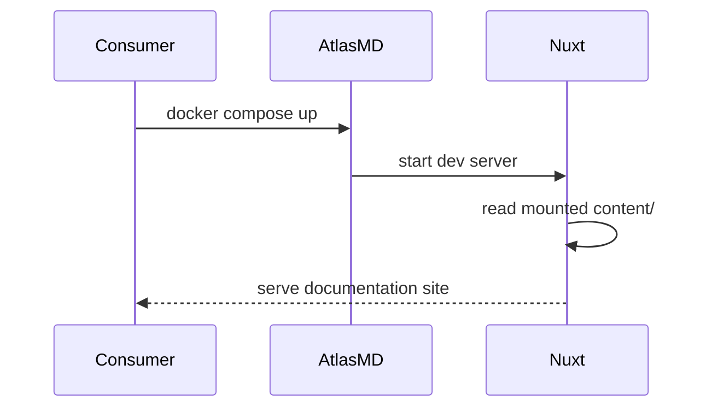
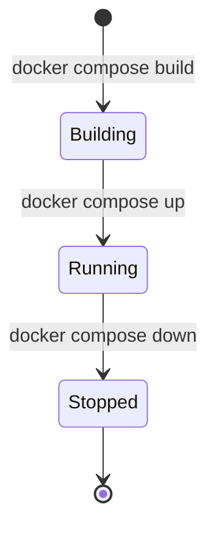
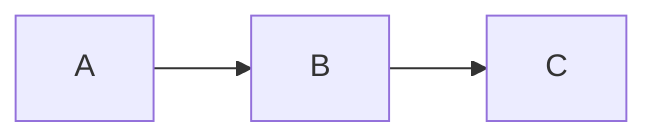

# Mermaid Diagrams

AtlasMD renders mermaid code blocks as interactive SVG diagrams with click-to-zoom. The renderer initializes mermaid with theme-aware colors (light and dark) and re-renders on theme switch.

## Live Examples

### Flowchart



### Sequence Diagram



### State Diagram



## Usage

Use a fenced code block with the `mermaid` language tag:

````markdown

````

## Features

- **Theme-aware**: Mermaid re-initializes with light or dark colors when the user toggles theme
- **Click-to-zoom**: Click the diagram to open a full-screen modal; press `Escape` or click outside to close
- **Supported languages**: `python`, `mermaid`, `jsonc` are registered in `nuxt.config.ts` under `mdc.highlight.langs`

## Source

`atlasmd-renderer/components/content/ProseCode.vue` — detects `language === 'mermaid'`, dynamically imports the mermaid library, renders the SVG, and handles the zoom modal. Theme variables are defined inline for both light and dark modes.
