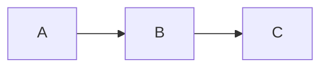

# Content Conventions

## File Naming

Use the `1.Title.md` format for documentation files:

- `1.overview.md`
- `2.architecture.md`
- `3.tech-glossary.md`

The numeric prefix controls ordering in the navigation sidebar. The text after the dot becomes the page title.

::note
Do not use `1-Title.md` (hyphen). Docus uses the dot separator for its ordering system.
::

## Directory Configuration

Each directory has a `_dir.yml` file:

```yaml
# top-level directory
title: Section Name
icon: heroicons:icon-name
```

```yaml
# subsection directory
title: Subsection Name
```

::note
Include `icon` only in top-level `_dir.yml` files. Do not add icons to subsection directories or individual markdown files.
::

## Navigation Redirect

To make a section redirect to its first child:

```yaml
title: Getting Started
icon: heroicons:academic-cap
navigation.redirect: /getting-started/overview
```

## MDC Syntax

AtlasMD supports Markdown Components (MDC) for rich content.

### Notes

```markdown
::note
Important clarification that readers should not miss.
::
```

### Side Notes

```markdown
::side-note
Step-by-Step
::

1. **Step One** - Description.
2. **Step Two** - Description.
```

### Images

Use the `::fig` component for images with dark/light mode support and click-to-zoom:

```markdown
::fig
---
src: /path/to/light/image.png
darkmodeSrc: /path/to/dark/image.png
caption: "Figure X: Description"
width: "600px"
---
::
```

See [Fig](/building-blocks/components/fig) for all props and usage patterns.

### Mermaid Diagrams

AtlasMD renders mermaid code blocks as interactive SVG diagrams with click-to-zoom:

````markdown

````

See [Mermaid Diagrams](/building-blocks/components/mermaid) for live examples.

### Other Components

AtlasMD provides additional MDC components: `::note`, `::side-note`, `::field`, `::simple-card`, `::example-component`, and Docus built-ins (`::block-hero`, `::card-grid`, `::card`). See [Building Blocks](/building-blocks) for live-rendered examples and full documentation of each component.

## Index Files

A file named `0.index.md` in a directory becomes the landing page for that section. Use it for section overviews and card grids that link to child pages.
